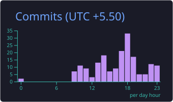

  
  &nbsp;&nbsp;
  

 

  
  &nbsp;
  
  &nbsp;
  
  &nbsp;
  

  <b>Computer Science Undergraduate · B.Tech CSE @ Chandigarh University</b> 
  Systems Architect · Distributed Platforms · Explainable AI · High-Resilience Backend Engines

### 🏆 GitHub Achievements

  
  &nbsp;&nbsp;
  
  &nbsp;&nbsp;
  

---

### ⚡ Overview

I'm a Computer Science undergraduate (B.Tech CSE, Chandigarh University) focused on engineering high-throughput, AI-integrated systems with architectures that prioritize inspectability, correctness, and deterministic safety over opaque black-box outputs.

- **Backend & Systems:** Designing concurrent, low-latency architectures with **FastAPI**, **Spring Boot**, and **Express**, paired with **PostgreSQL**, **PostGIS**, and **Redis** for distributed geospatial routing, live caching, and sub-100ms event processing.
- **Applied AI & Explainability:** Architecting causal reasoning and retrieval-augmented generation (RAG) pipelines backed by **Tree-sitter AST parsing**, **pgvector/Qdrant** vector search, semantic embeddings, and deterministic risk AST evaluators where verified traceability takes precedence over hallucination.
- **Frontend & GIS:** Crafting ultra-responsive, mobile-first interfaces using **React 19**, **Next.js 14**, **Vite**, **Tailwind CSS**, and **Leaflet.js** with curated dark-mode design systems (Midnight Navy, Deep Slate, and Emerald tokens).

> **Current Focus:** Engineering high-resilience quantitative engines, developer intelligence platforms, distributed real-time mesh networks, and deterministic geospatial routing systems targeting high-signal Software Engineering and Systems roles.

---

## 🛠️ Languages & Technologies

  <b>Languages & Core:</b> 
  
  
  
  
  
  
  
  

  <b>Frameworks, Frontend & Real-time:</b> 
  
  
  
  
  
  
  
  

  <b>Databases, Vector Stores & DevOps:</b> 
  
  
  
  
  
  
  
  

---

### 🧩 Core Competencies

<table width="100%">
  <tr>
    <td width="50%" valign="top">
      <h4>⚡ Full-Stack & Systems Engineering</h4>
      <ul>
        <li><b>Frontend:</b> React 19, Next.js 14, Vite, Tailwind CSS, Leaflet.js, Monaco Editor, Three.js</li>
        <li><b>Backend Services:</b> FastAPI (Python 3.11+), Spring Boot (Java), Express.js (Node.js)</li>
        <li><b>Protocols & Real-Time:</b> WebSockets, Server-Sent Events, Redis Pub/Sub, Redis Streams, Celery Task Queues</li>
        <li><b>Performance:</b> Code-splitting, sub-second TTFB, offline PWA caching, async DMA pipelines</li>
      </ul>
    </td>
    <td width="50%" valign="top">
      <h4>🤖 Applied AI & Explainable Systems</h4>
      <ul>
        <li><b>Causal Reasoning & ASTs:</b> Tree-sitter AST syntax chunking, semantic git diff analysis, calibrated confidence scoring</li>
        <li><b>Vector Search & RAG:</b> PostgreSQL + pgvector (HNSW), Qdrant vector engine, hybrid dense/sparse retrieval</li>
        <li><b>Model Orchestration:</b> Claude 3.5 Sonnet, OpenAI (GPT-4o & embeddings), Gemini API, structured tool calling</li>
        <li><b>Evaluations:</b> Grounded accuracy, deterministic verification ASTs, multi-factor risk attribution</li>
      </ul>
    </td>
  </tr>
  <tr>
    <td width="50%" valign="top">
      <h4>🗺️ Geospatial Data & Real-Time Engines</h4>
      <ul>
        <li><b>Spatial Databases:</b> PostgreSQL, PostGIS, TimescaleDB, Redis Streams</li>
        <li><b>GIS & Routing:</b> Shapely, Overpass OSM API, dynamic bypass polyline calculation, Leaflet.js</li>
        <li><b>Environmental Fusion:</b> Live IMD meteorological telemetry, contour slope radars, multi-zone classification</li>
        <li><b>Physiological Risk:</b> Acute Mountain Sickness (AMS) hypoxia elevation curves</li>
      </ul>
    </td>
    <td width="50%" valign="top">
      <h4>⚙️ Infrastructure, Security & Reliability</h4>
      <ul>
        <li><b>Containers & Orchestration:</b> Docker, Docker Compose multi-container networks, Kubernetes manifests</li>
        <li><b>CI/CD & Automation:</b> GitHub Actions multi-stage build & test pipelines, Vercel production edge</li>
        <li><b>Cryptographic Security:</b> AES-256 envelope vault encryption, OAuth 2.0, Firebase Admin SDK, JWT</li>
        <li><b>Observability:</b> Structured logging, health check endpoints, automated test suites (pytest)</li>
      </ul>
    </td>
  </tr>
</table>

---

### 🚀 Featured Engineering Systems

#### **1. CLUDE — Autonomous Production Incident Root-Cause Engine & Codebase Intelligence**
> Pinpoints the exact commit that broke production with causal AI reasoning and onboards engineers to unfamiliar codebases in minutes. Evaluates semantic causality across structural git diffs to correlate multiline stack traces (Python, Node.js/TS, Go, Java, Rust) against commit history in < 8s. Features Tree-sitter syntax-aware AST chunking, PostgreSQL 16 with `pgvector` HNSW acceleration, Claude 3.5 Sonnet / GPT-4o causal reasoning chains with calibrated confidence scoring, embedded Monaco-style syntax diff viewer, high-risk churn danger-zone detection, interactive GitHub account connection with granular repository permissions, and repo-grounded dark-mode Mermaid.js architectural topology graphs.

  
  
  
  
  
  
  
  

[→ Live Demo](https://frontend-mu-roan-llgeruknl5.vercel.app) &nbsp;|&nbsp; [→ Source Code](https://github.com/arnnnnaaavvvvv/CLUDE) &nbsp;|&nbsp; [→ Architecture Spec](https://github.com/arnnnnaaavvvvv/CLUDE/blob/main/ARCHITECTURE.md)

---

#### **2. IGNITE — Dynamic Tourist Safety & Smart Route Engine**
> Pan-India tourist safety routing and itinerary engine covering all **28 States & 8 Union Territories**. Fuses live IMD meteorological data, 6 environmental natural zones, Acute Mountain Sickness (AMS) hypoxia altitude risk scoring, date-aware regional crowd curves, and autonomous hazard rerouting into an explainable, deterministic risk-scored engine. Features offline-first Leaflet GIS maps, real-time WebSocket emergency mesh telemetry, red/yellow/green semantic risk hierarchy, single-accent Midnight Navy & Emerald UI, dual-language engine (EN/HI) with toggle-driven display, and multi-agency emergency rescue dispatch (SDRF/NDRF/ITBP).

  
  
  
  
  
  
  
  

[→ Live Production Demo](https://ignite-lemon-nu.vercel.app/) &nbsp;|&nbsp; [→ Source Code](https://github.com/arnnnnaaavvvvv/IGNITE) &nbsp;|&nbsp; [→ Architecture Spec](https://github.com/arnnnnaaavvvvv/IGNITE/blob/main/ARCHITECTURE.md)

---

#### **3. SIRUS — Enterprise Multi-Tenant Quantitative Engine & Algorithmic Trading Platform**
> High-throughput systematic algorithmic trading SaaS with Direct Market Access (Zerodha Kite, Alpaca, KuCoin, Interactive Brokers, AngelOne, Upstox, Groww). Features sub-100ms vectorized NumPy/Pandas strategy backtesting processing **540,000 ticks/sec**, an AES-256 envelope-encrypted Demat key vault, interactive real-time parameter simulator, Redis Streams event bus, and a Paddle Billing inspired sleek dark interface with Three.js wave particle visuals.

  
  
  
  
  
  
  

[→ Live Production Demo](https://web-frontend-three-gamma.vercel.app/) &nbsp;|&nbsp; [→ Source Code](https://github.com/arnnnnaaavvvvv/SIRUS) &nbsp;|&nbsp; [→ Architecture Spec](https://github.com/arnnnnaaavvvvv/SIRUS/blob/main/ARCHITECTURE.md)

---

#### **4. AI Developer Copilot & Career Intelligence Platform**
> Full-stack talent intelligence engine parsing resumes, job descriptions, and public profile data (GitHub & LinkedIn) to power semantic ATS scoring, vector-based skill gap identification, salary regression predictions, and mock interview question generation using dense vector embeddings and HNSW similarity search.

  
  
  
  
  

[→ Live Production Demo](https://rlg-platform.vercel.app/) &nbsp;|&nbsp; [→ Source Code](https://github.com/arnnnnaaavvvvv/AI-Developer-Copilot-Career-Intelligence-Platform) &nbsp;|&nbsp; [→ Architecture Spec](https://github.com/arnnnnaaavvvvv/AI-Developer-Copilot-Career-Intelligence-Platform/blob/main/ARCHITECTURE.md)

---

## 📊 GitHub Contribution & Activity

  

    
  

  

    
    &nbsp;
    
  

  
  

    
    &nbsp;
    
  

---

## 🔭 Currently Exploring & Engineering

- **Low-Latency Distributed Systems:** Benchmarking zero-allocation serialization protocols and concurrent actor models.
- **Geospatial Indexing at Scale:** High-resolution spatial partitioning using Uber H3 hexagonal hierarchical spatial indexes.
- **Deterministic Explainability in AI:** Combining probabilistic LLM tool outputs with formal rule-based verification ASTs.

---

## 🤝 Connect With Me

  
  &nbsp;&nbsp;
  
  &nbsp;&nbsp;
  

---

  Engineered with precision by <b>Arnav Singh</b> · B.Tech CSE @ Chandigarh University · Built for High-Resilience Production

