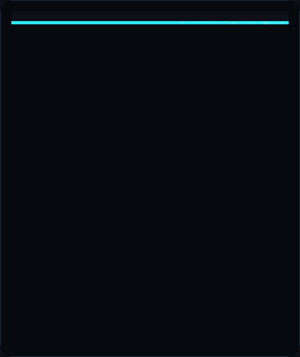
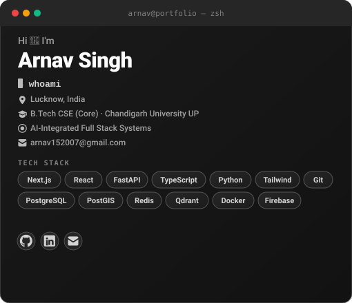
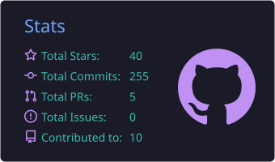
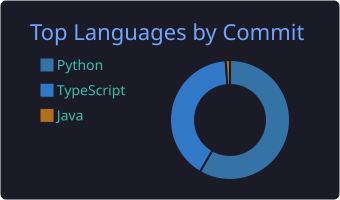

  
  &nbsp;&nbsp;
  

 

  
  &nbsp;
  
  &nbsp;
  
  &nbsp;
  
  &nbsp;
  

---

### ⚡ Overview

I'm a Computer Science undergraduate (B.Tech CSE, Chandigarh University UP) building full-stack, AI-integrated systems with a focus on architecture that's inspectable rather than black-box. My backend work spans Spring Boot, Express, and FastAPI depending on the problem; my data layer combines PostgreSQL, PostGIS, and Redis for geospatial and real-time workloads; and my AI systems are built around Qdrant-backed retrieval and explainable scoring, not opaque model outputs alone. I favor deterministic, rule-based engines where correctness and traceability matter more than raw prediction — and RAG pipelines where grounded retrieval beats hallucination-prone generation.

> **Current Focus:** Engineering high-resilience quantitative engines, real-time systems, and distributed platforms targeting high-signal Software Engineering / Systems roles.

---

## 🛠️ Languages & Tools

  

---

### 🧩 Core Competencies

<table width="100%">
  <tr>
    <td width="50%" valign="top">
      <h4>⚡ Full-Stack Development</h4>
      <ul>
        <li><b>Frontend:</b> Next.js 14, React, Vite, Tailwind CSS, Launch UI, Three.js</li>
        <li><b>Backend:</b> Spring Boot, Express, FastAPI, Async DMA Pipelines</li>
        <li><b>Languages:</b> Java, Python, TypeScript, JavaScript, HTML5, CSS3</li>
      </ul>
    </td>
    <td width="50%" valign="top">
      <h4>🤖 AI/ML & LLM Systems</h4>
      <ul>
        <li><b>Model Access:</b> OpenAI (embeddings + GPT), Google Gemini API</li>
        <li><b>Vector Search:</b> Qdrant</li>
        <li><b>Applications:</b> RAG architecture, multi-agent systems, deterministic explainable scoring</li>
      </ul>
    </td>
  </tr>
  <tr>
    <td width="50%" valign="top">
      <h4>🗺️ Data & Geospatial</h4>
      <ul>
        <li><b>Databases:</b> PostgreSQL, TimescaleDB, PostGIS, Redis</li>
        <li><b>Geospatial:</b> PostGIS, Shapely, Leaflet.js</li>
        <li><b>Real-time:</b> WebSockets, Redis Pub/Sub, Redis Streams</li>
      </ul>
    </td>
    <td width="50%" valign="top">
      <h4>⚙️ Infrastructure & Testing</h4>
      <ul>
        <li><b>Containers/Orchestration:</b> Docker, Kubernetes</li>
        <li><b>CI/CD & VCS:</b> Git, GitHub Actions, Vercel Production</li>
        <li><b>Auth & Security:</b> AES-256 Envelope Vault, Firebase Admin SDK, JWT</li>
        <li><b>Testing:</b> pytest, Next.js Production Builds</li>
      </ul>
    </td>
  </tr>
</table>

---

### 🚀 Featured Engineering Systems

#### **1. IGNITE — Dynamic Tourist Safety & Smart Route Engine**
> Destination-agnostic safety routing platform that fuses live meteorological data, crowd density, terrain hazards, and emergency-service proximity into an explainable, deterministic risk-scored itinerary engine with real-time geofencing.

  
  
  
  
  

[→ Live Demo](https://ignite-lemon-nu.vercel.app/) &nbsp;|&nbsp; [→ Source Code](https://github.com/arnnnnaaavvvvv/IGNITE) &nbsp;|&nbsp; [→ Architecture Spec](https://github.com/arnnnnaaavvvvv/IGNITE/blob/main/ARCHITECTURE.md)

---

#### **2. SIRUS — Enterprise Multi-Tenant Quantitative Engine & Algorithmic Trading Platform**
> High-throughput systematic trading SaaS with direct market access (Zerodha Kite, Alpaca, KuCoin, Interactive Brokers, AngelOne, Upstox, Groww), sub-100ms vectorized NumPy/Pandas strategy backtesting, AES-256 envelope-encrypted Demat key vault, interactive on-page parameter simulator, and Launch UI landing design.

  
  
  
  
  
  
  

[→ Live Demo](https://web-frontend-three-gamma.vercel.app/) &nbsp;|&nbsp; [→ Source Code](https://github.com/arnnnnaaavvvvv/SIRUS) &nbsp;|&nbsp; [→ Architecture Spec](https://github.com/arnnnnaaavvvvv/SIRUS/blob/main/ARCHITECTURE.md)

---

#### **3. AI Developer Copilot & Career Intelligence Platform**
> Full-stack talent intelligence engine parsing resumes, JDs, and public profile data (GitHub/LinkedIn) to power semantic ATS scoring, vector-based skill gap identification, salary regression predictions, and mock interview generation.

  
  
  
  
  

[→ Live Demo](https://rlg-platform.vercel.app/) &nbsp;|&nbsp; [→ Source Code](https://github.com/arnnnnaaavvvvv/AI-Developer-Copilot-Career-Intelligence-Platform) &nbsp;|&nbsp; [→ Architecture Spec](https://github.com/arnnnnaaavvvvv/AI-Developer-Copilot-Career-Intelligence-Platform/blob/main/ARCHITECTURE.md)

---

## 📊 GitHub Statistics & Metrics

  

    
    &nbsp;
    
  

  

    
  

---

## 🤝 Connect With Me

  
  &nbsp;&nbsp;
  
  &nbsp;&nbsp;
  

---

  Engineered by <b>Arnav Singh</b> · Focused on Production Engineering & AI Systems · Chandigarh University

